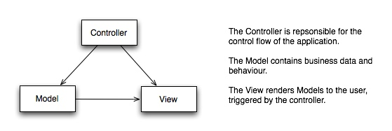
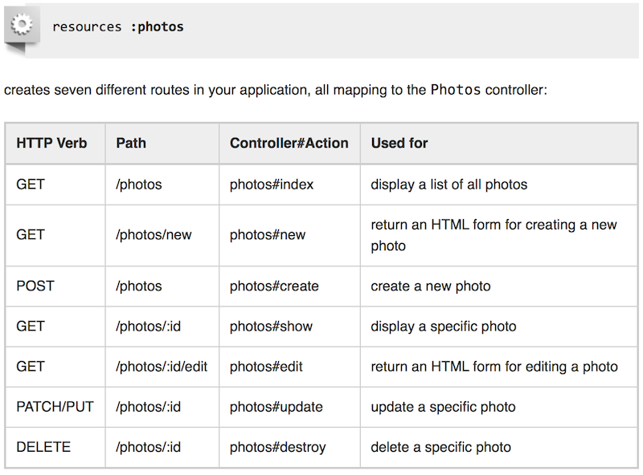
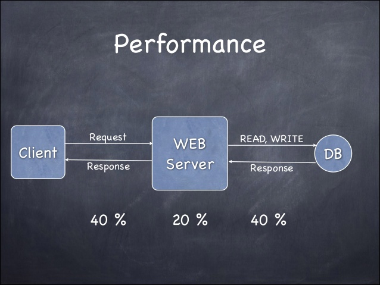

!SLIDE subsection

# Intro to Ruby on Rails

Really? How many slides? -- ~~~NUM_SLIDES~~~

<!SLIDE bullets>
# Ruby on Rails
- bundler
- scaffolding, and generators
- polyglot; haml and sass
- Yaml, JSON, not XML
- Testing, Rspec, Cucumber

!SLIDE

# Ruby on Rails
Was created by David Heinemeier Hansson as a kind of byproduct of Basecamp’s development at 37signals in 2004.

Basecamp was built in Ruby because Hansson found PHP and Java not powerful or flexible enough.

Rails is founded on pragmatism and established paradigms instead of exotic new ideas. And that’s what made it so successful.

!SLIDE

## Rails is based on the Model-View-Controller pattern.

The Models are your business objects describing the structure and behavior of the problem your application is trying to solve. These are usually backed by an Object-Relational-Mapping framework that persists your objects to a database in the background.

The Views are the templates that render data to the user and all the logic surrounding presentational aspects of your app.

- MVC Framework

!SLIDE

## Model-View-Controller (cont)

The Controller sits at the heart of everything, processing requests from clients, initiating changes in the models and triggering the rendering of the templates.

- MVC Framework

!SLIDE

# Rails is “opinionated software.”
It doesn’t want to be everything for everyone. It focuses on one way of doing things and streamlines all its parts around that way.

That’s not to say there’s no possibility of doing things differently if you need to, but you’ll definitely have it easier if you do things “the Rails way.”

Programmer productivity was the main goal during Rails’ development, not performance.

!SLIDE

- Convention over Configuration
- KIS
- Testable

!SLIDE

##  Readability Clarity, KIS!

!SLIDE bullets incremental

## Polyglot Ruby ; CoffeeScript Haml and Sass

multiple programming languages and multiple "modularity paradigms" in application development. (!GWT !node.js and javascript everywhere)

- [CoffeeScript](http://coffeescript.org)
- [Js2coffee](http://js2coffee.org)
- [Haml](http://haml.info)
- [Sass](http://sass-lang.com)

!SLIDE

# REST

<!SLIDE bullets incremental transition=fade>

# Performance
Ruby is slower than Java!

... True!  But ...

!SLIDE

# Get to know the tools

## Text Editor

[Textmate 2](http://blog.macromates.com/2011/textmate-2-0-alpha/), [Sublime Text](http://www.sublimetext.com/), Vim and Emacs are examples of text editors your can use for writing code and editing files.

## Terminal

Bash, [Zsh](), Where you start the rails server and run commands.

## Web browser

(Firefox, Safari, Chrome) for viewing your application.

